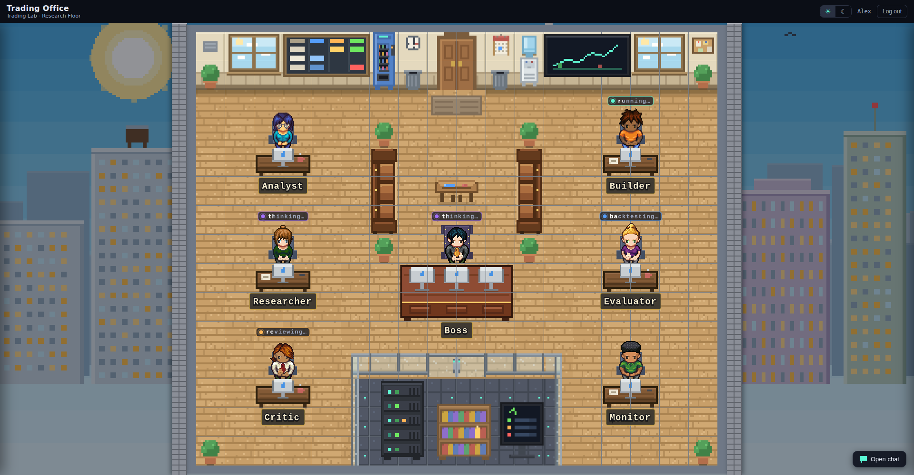

# Trading Office

> Визуальная диспетчерская (control room) для агентных торговых систем.
> Read-only: офис ничего не исполняет — он показывает.



## Что это такое

**Trading Office** — это pixel-art «офис», в котором каждый AI-агент торговой
системы превращается в спрайт за рабочим столом с живым статусом над головой
(`running…`, `thinking…`, `backtesting…`, `reviewing…`). Это витрина и пульт
наблюдения поверх других систем, а не ещё одна торговая система.

Ключевой принцип — **no execution authority**: у офиса нет прав на исполнение.
Данные и торговлю держат внешние сервисы:

- `trading-platform` — источник истины по исполнению и данным;
- `trading-lab` — первая подключённая агентная система, её агенты живут на
  первом «этаже» офиса (Trading Lab · Research Floor).

Офис только читает их состояние и рисует его. Ни одной команды на запись в нём нет.

## Что он умеет

- **Этаж с агентами.** Семь агентов Trading Lab — Analyst, Builder, Researcher,
  Boss, Evaluator, Critic, Monitor — каждый за своим столом, со своим статусом
  в реальном времени.
- **Панели справа.** Клик по агенту или объекту открывает панель: гипотезы,
  бэктесты, база знаний, здоровье инфраструктуры, лог-активность.
- **Оператор-чат.** Чат с агентами в правом доке. В mock-режиме он инертный
  (заглушка с имитацией ответа), в режиме `trading-lab` — проксируется
  в реальный чат-API лаборатории.
- **Поток событий.** Один read-only WebSocket гонит статусы, реплики чата
  и heartbeat; фронт переподключается с backoff.
- **Мониторинг платформы.** В режиме `trading-lab` офис дополнительно
  показывает бот-раны и инфра-домены `trading-platform` (ops read API).
- **Два режима оформления.** Переключатель в шапке: «Day Office» (дневной офис)
  и «Night Control Room» (ночная диспетчерская).
- **Деградация вместо падений.** Сбой апстрима становится видимым типизированным
  статусом источника (панель Infra), а не HTTP 500 на весь дашборд. Токены
  чтения живут только на сервере и никогда не попадают ни в браузер, ни в логи.

## Архитектура

```text
Браузер — React + PixiJS                      apps/web
   │   HTTP-снимки + один read-only WebSocket
   ▼
Office Gateway — Hono, read-only              apps/server
   │
   ├── фикстуры (детерминированные демо-данные)        ← режимы mock / connected
   └── trading-lab read/chat API
       + (опционально) trading-platform ops read API   ← режим trading-lab
```

PixiJS рисует только сам этаж. Внешний экран, логин, шапка, панели
и маршрутизация — обычный React/DOM. Единственная граница данных — read-only
интерфейс `OfficeGateway`.

### Структура репозитория

| Путь | Что это |
| --- | --- |
| `apps/web/` | Фронт-приложение: внешний экран города, mock-логин, этаж и роутер панелей |
| `apps/server/` | Office Gateway (Hono): HTTP-снимки + WebSocket-поток поверх коннекторов |
| `packages/office-gateway/` | Контракт шлюза: DTO, zod-схемы, дескрипторы маршрутов, схема `OfficeEvent` (чистый, безопасный для браузера) |
| `packages/office-fixtures/` | Общие детерминированные демо-данные |
| `packages/office-visual-kit/` | Движок рендера: ядро PixiJS v8, загрузчик Tiled, схема сцены, камера, React-обёртка |
| `packages/trading-lab-floor/` | Единый источник этажа Trading Lab: конфиг сцены, карты Tiled, ассеты, генераторы |
| `examples/trading-lab-research-floor/` | Технический превью этажа (оверлей DebugCard) |
| `docs/superpowers/` | Спеки и планы по фазам (1 → 4b) |

### API шлюза

Все маршруты read-only; пути с префиксом `/api/office`.

| Метод | Путь | Отдаёт |
| --- | --- | --- |
| `GET` | `/agents/statuses` | статусы агентов на этаже |
| `GET` | `/hypotheses` | гипотезы |
| `GET` | `/backtests` | бэктесты |
| `GET` | `/knowledge` | базу знаний |
| `GET` | `/bots` | бот-раны платформы (режим `trading-lab`) |
| `GET` | `/infra` | состояние источников и инфраструктуры |
| `POST` | `/operator/messages` | сообщение оператора в чат |
| `WS` | `/events` | поток событий: статусы, чат, heartbeat |

## Режимы запуска

| Режим | Команда | Что под капотом |
| --- | --- | --- |
| **mock** (по умолчанию) | `npm run dev` | только фронт + фикстуры прямо в браузере, без сервера |
| **connected** | `npm run dev:connected` | фронт + gateway (`apps/server`) на фикстурах |
| **trading-lab** | env + `npm run dev:connected` | gateway ходит в реальные API `trading-lab` (и опционально `trading-platform`) |

## Запуск

Требования: **Node ≥ 20.19**.

### Быстрый старт (mock)

```bash
npm install
npm run dev          # → http://localhost:5174
```

Откройте http://localhost:5174, кликните по двери здания, чтобы войти (mock-логин),
и осмотрите этаж Trading Lab: кликайте по агентам и объектам — справа открываются
панели; дверь у входа возвращает в лобби.

Превью самого этажа (без приложения, с дебаг-оверлеем):

```bash
npm run dev:preview  # → http://localhost:5173
```

### Подключённый режим (фронт + сервер на фикстурах)

```bash
npm run dev:connected   # web → :5174, gateway → :8787
```

Фронт берёт `apps/web/.env.connected` (`VITE_OFFICE_MODE=connected`), сервер
стартует в режиме `fixture`. Удобно проверять HTTP/WebSocket-контур без реального
`trading-lab`.

### Боевой режим (trading-lab)

Сервер читает конфиг из переменных окружения процесса (автозагрузки `.env` нет —
переменные нужно экспортировать). Полный список — в `apps/server/.env.example`.

```bash
# gateway → реальный trading-lab
export OFFICE_CONNECTOR_MODE=trading-lab
export TRADING_LAB_READ_URL=http://localhost:3100
export TRADING_LAB_READ_TOKEN=<токен чтения>
export TRADING_LAB_CHAT_URL=http://localhost:3000     # опционально — оператор-чат
export TRADING_LAB_CHAT_TOKEN=<токен чата>            # опционально

# опционально — мониторинг платформы (только в режиме trading-lab)
export OFFICE_PLATFORM_ENABLED=true
export TRADING_PLATFORM_READ_URL=http://localhost:8839
export TRADING_PLATFORM_READ_TOKEN=<токен ops-read>

npm run dev:connected
```

Без `TRADING_LAB_READ_URL` и `TRADING_LAB_READ_TOKEN` сервер в этом режиме
осознанно падает на старте — чтобы не притворяться живым на пустых данных.

### Прочие команды

```bash
npm run build         # typecheck + сборка всех workspace-пакетов
npm test              # юнит-тесты сервера и фронта
npm run generate      # перегенерировать пиксельные ассеты и карты Tiled
npm run verify:assets # упасть, если синхронизированные ассеты этажа разъехались
```

## Внешний вид и лицензия

Визуальный стиль («Retro Pixel AI Research Tower») оригинальный. Ассеты окружения
генерируются детерминированными скриптами в `packages/trading-lab-floor/tools/`
(эквивалент CC0). Спрайты агентов собраны из слоёв Universal LPC Spritesheet
Character Generator (CC-BY-SA 3.0; атрибуция —
в `packages/trading-lab-floor/public/assets/third-party/lpc/`).

Код и сгенерированные ассеты — под лицензией MIT, см. [`LICENSE`](LICENSE).
Полная политика по ассетам — в `packages/office-visual-kit/docs/asset-guidelines.md`.

---

<p align="center"></p>
